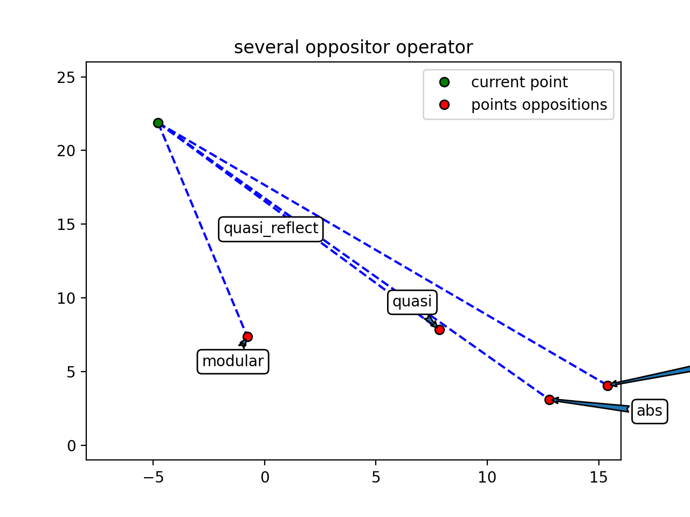

# Opposition learning operators and population initializers

[](https://pypi.org/project/OppOpPopInit/)
[](https://pepy.tech/project/oppoppopinit)
[](https://pepy.tech/project/oppoppopinit)
[](https://pepy.tech/project/oppoppopinit) 

[](https://gitter.im/opp-op-pop-init/community?utm_source=badge&utm_medium=badge&utm_campaign=pr-badge&utm_content=badge)

**OPP**osition learning **OP**erators and **POP**ulation **INIT**ializers is the python package containing opposition learning operators and population initializers for evolutionary algorithms.


- [Opposition learning operators and population initializers](#opposition-learning-operators-and-population-initializers)
  - [Installation](#installation)
  - [About opposition operators](#about-opposition-operators)
  - [Imports](#imports)
  - [Interface agreements](#interface-agreements)
    - [Borders](#borders)
    - [Format of **creators** and **oppositors**](#format-of-creators-and-oppositors)
  - [Available opposition operators](#available-opposition-operators)
    - [Checklist](#checklist)
    - [Examples](#examples)
      - [`abs` oppositor](#abs-oppositor)
      - [`modular` oppositor](#modular-oppositor)
      - [`quasi` oppositor](#quasi-oppositor)
      - [`quasi_reflect` oppositor](#quasi_reflect-oppositor)
      - [`over` oppositor](#over-oppositor)
      - [`integers_by_order` oppositor](#integers_by_order-oppositor)
      - [More examples](#more-examples)
    - [Partial/Combined oppositor](#partialcombined-oppositor)
    - [RandomPartialOppositor](#randompartialoppositor)
    - [Reflect method](#reflect-method)
    - [Reflection with selection best](#reflection-with-selection-best)
  - [Population initializers](#population-initializers)
    - [Simple random populations](#simple-random-populations)
      - [`RandomInteger`](#randominteger)
      - [`Uniform`](#uniform)
      - [`Normal`](#normal)
      - [`Mixed`](#mixed)
    - [Populations with oppositions](#populations-with-oppositions)

## Installation

```
pip install OppOpPopInit
```

or 

```
pip3 install OppOpPopInit
```

## About opposition operators

In several evolutionary algorithms it can be useful to create the opposite of some part of current population to explore searching space better. Usually it uses at the begging of searching process (with first population initialization) and every few generations with decreasing probability `F`. Also it's better to create oppositions of worse objects from populations. See [this article](https://www.google.ru/url?sa=t&rct=j&q=&esrc=s&source=web&cd=&cad=rja&uact=8&ved=2ahUKEwi5kN-7gdDtAhUklIsKHRFnC7wQFjAAegQIAxAC&url=https%3A%2F%2Fwww.researchgate.net%2Fprofile%2FMohamed_Mourad_Lafifi%2Fpost%2FCan_anybody_please_send_me_MatLab_code_for_oppotion_based_PSO_BBO%2Fattachment%2F5f5be101e66b860001a0f71c%2FAS%253A934681725919233%25401599856897644%2Fdownload%2FOpposition%2Bbased%2Blearning%2BA%2Bliterature%2Breview.pdf&usg=AOvVaw02oywUU7ZaSWH24jkmNxPu) for more information. 

This package provides several operators for creating oppositions (**opposition operators**) and methods for creating start population using different distribution functions and opposition operators *for each dimension*!

## Imports

What can u import from this package:

```python
from OppOpPopInit import OppositionOperators # available opposition operators as static class
from OppOpPopInit import SampleInitializers  # available population initializers as static class

# main function which creates random population
# using initializers and oppositors
from OppOpPopInit import init_population 
```

Also there is a little module for plotting pictures like u can see below

```python
import OppOpPopInit.plotting
```

## Interface agreements

### Borders

In the entire part of math optimization tasks the best skin of possible solutions is using 1D-vectors `(x1, x2, ..., xn)` of variables where each variables `x` can be from some area `[xmin, xmax]`. [geneticalgorithm2 package](https://github.com/PasaOpasen/geneticalgorithm2) and this package are both geared towards this case.

So, many functions here takes arguments `minimums` and `maximums` which mean the lower and the upper bounds (borders) of available areas by each using dimension. `minimums` and `maximums` should be sequences of integer or real numbers or only one number, but they cannot be numbers both and they must have equal length if they are sequence both.

### Format of **creators** and **oppositors**

**Creators** are functions which create random samples (depended on bounds). In code a creator can be any object who can be called like function with signature `() -> np.ndarray` (`Callable[[], np.ndarray]`).

**Oppositors** are functions which take `np.ndarray` samples and return it's opposed form as `np.ndarray`. So in code an oppositor if the object can be called like `(np.ndarray) -> np.ndarray` (`Callable[[np.ndarray], np.ndarray]`).

## Available opposition operators

### Checklist

*`OppositionOperators.Continual.abs`
*`OppositionOperators.Continual.modular`
*`OppositionOperators.Continual.quasi`
*`OppositionOperators.Continual.quasi_reflect`
*`OppositionOperators.Continual.over`
*`OppositionOperators.Continual.Partial` -- for using several opposition operators for each subset of searching area.
*`OppositionOperators.Discrete.integers_by_order` -- it's like `abs` operator but for integer values

*`OppositionOperators.CombinedOppositor` -- for using existing opposition operators for each dimension with continual or mixed task. See example[below](#partial-oppositor)

U can create your own oppositor using pattern:

```python
def oppositor(sample: np.ndarray) -> np.ndarray:
  # some code
  return new_sample
```

There are also `OppositionOperators.Discrete._index_by_order` and `OppositionOperators.Discrete.value_by_order` constructors for very special discrete tasks with available sets of valid values (like `[-1, 0, 1, 5, 15]`), but it's highly recommended to convert this task to indexes array task (and use `OppositionOperators.Discrete.integers_by_order`) like below:

```python
# available values
vals = np.array([1, 90. -45, 3, 0.7, 3.4, 12])

valid_array_example = np.array([1, 1, 1, 3, -45])

# function
def optimized_func(arr: np.ndarray) -> float:
    #some code
    return result

# recommented way for optimization algorithm
indexes = np.arange(vals.size)

def new_optimized_functio(new_arr):
    arr = np.array([vals[i] for i in new_arr])
    return optimized_func(arr)

# and forth u are using indexes format for your population

print(
  new_optimized_functio(
    np.array([0, 0, 1, 4])
  )
)
```

### Examples

#### `abs` oppositor

[Code](tests/op_abs.py)

        


#### `modular` oppositor

[Code](tests/op_modular.py)

        


#### `quasi` oppositor

[Code](tests/op_quasi.py)

        


#### `quasi_reflect` oppositor

[Code](tests/op_quasi_reflect.py)

        


#### `over` oppositor

[Code](tests/op_over.py)

        

#### `integers_by_order` oppositor

[Code](tests/op_integers_by_order.py)


#### More examples

[Code](tests/more_examples.py)




### Partial/Combined oppositor

If u want to use some oppositor to one dimenstion subset (e. g. indexes 0, 1, 3) and other oppositors for other subsets (e. g. indexes 2, 4, 5) -- u need to create `Partial` or `Combined` oppositors. The difference between them is that u need existing oppositors to make combined oppositor with them and u need oppositor makers to make partial oppositor. So, `Partial` oppositor is often easier to use but `Combined` is more flexible.

To create `Combined` oppositor use code like:

```python
oppositor = OppositionOperators.CombinedOppositor(
  [
    (sequece of indexes to apply, oppositor_for_this_dimentions),
    (sequece of indexes to apply, oppositor_for_this_dimentions),
    ...
    (sequece of indexes to apply, oppositor_for_this_dimentions)
  ]
)
```

To create `Partial` oppositor use code:

```python
oppositor = OppositionOperators.PartialOppositor(
    minimums=minimumns,
    maximums=maximums,
    indexes_to_opp_creator=[
        (sequece of indexes to apply, oppositor_creator),
        (sequece of indexes to apply, oppositor_creator)
    ]
)
```


Example:

```python
import numpy as np
from OppOpPopInit import OppositionOperators

# 5 dim population

min_bound = np.array([-8, -3, -5.7, 0, 0])
max_bound = np.array([5, 4, 4, 9, 9])

# population points
points = np.array([
  [1, 2, 3, 4, 7.5],
  [1.6, -2, 3.9, 0.4, 5],
  [1.1, 3.2, -3, 4, 5],
  [4.1, 2, 3, -4, 0.5]
])

# saved indexes for oppositors
first_op_indexes = np.array([0, 2])
second_op_indexes = np.array([1, 3])

oppositor = OppositionOperators.CombinedOppositor(
  [
    (first_op_indexes, OppositionOperators.Continual.abs(
      minimums=min_bound[first_op_indexes],
      maximums=max_bound[first_op_indexes],
    )),
    (second_op_indexes, OppositionOperators.Continual.over(
      minimums=min_bound[second_op_indexes],
      maximums=max_bound[second_op_indexes],
    ))
  ]
)

# or 

oppositor = OppositionOperators.PartialOppositor(
    minimums=min_bound,
    maximums=max_bound,
    indexes_to_opp_creator=[
        (first_op_indexes, OppositionOperators.Continual.abs),
        (second_op_indexes, OppositionOperators.Continual.over)
    ]
)

# as u see, it's not necessary to oppose population by all dimensions, here we won't oppose by last dimension

oppositions = OppositionOperators.Reflect(points, oppositor)

print(oppositions)

# array([[-4.        ,  1.84589799, -4.7       ,  5.04795851,  7.5       ],
#       [-4.6       , -0.74399971, -5.6       ,  7.49178902,  5.        ],
#       [-4.1       ,  0.54619162,  1.3       ,  6.14214043,  5.        ],
#       [-7.1       , -2.59648698, -4.7       ,  0.95770904,  0.5       ]])

```

[Another example code](tests/op_mixed.py)


### RandomPartialOppositor

Create `RandomPartialOppositor` oppositor using this structure:

```python
oppositor = OppositionOperators.RandomPartialOppositor(
    [
        (count_of_random_dimensions, repeate_config_during_steps, oppositor_creator),
        (count_of_random_dimensions, repeate_config_during_steps, oppositor_creator),
        ...
        (count_of_random_dimensions, repeate_config_during_steps, oppositor_creator)
    ],
    minimums,
    maximums,
    current_dimension_count
)
```

See [simplest example of using](tests/random%20partial%20oppositor.py)


### Reflect method

Use `OppositionOperators.Reflect(samples, oppositor)` for oppose samples array using some oppositor. `samples` argument here is 2D-array with size samples*dimension.

### Reflection with selection best

There is `OppositionOperators.ReflectWithSelectionBest(population_samples, oppositor, eval_func, samples_scores = None, more_is_better = False)` method for reflect population (with size `N`) and select best `N` objects from existing `2N` objects. It has parameters:

* `population_samples` : 2D numpy array;
            reflected population.
* `oppositor` : function;
            applying oppositor.
* `eval_func` : function;
            optimized function of population/task.
* `samples_scores` : `None`/1D numpy array, optional;
            scores for reflected population (if calculated -- it's not necessary to calculate it again). The default is `None`.
* `more_is_better` : logical, optional;
            The goal -- is maximize the function. The default is `False`.

See [example](tests/reflection_with_selection.py)


## Population initializers

### Simple random populations

Like `oppositors operators` there are some constructors for creating start population:

* `SampleInitializers.RandomInteger(minimums, maximums)` -- returns function which will return random integer vectors between `minimums` and `maximums`
* `SampleInitializers.Uniform(minimums, maximums)` -- returns function which will return random vectors between `minimums` and `maximums` from uniform distribution
* `SampleInitializers.Normal(minimums, maximums, sd = None)` -- returns function which will return random vectors between `minimums` and `maximums` from normal distribution

U can create your initializer function:
```python
def func():
    # code
    return valid_sample_array 
```

There is also `SampleInitializers.Combined(minimums, maximums, list_of_indexes, list_of_initializers_creators)` for generate population with [different constructors for each dimension](#mixed)!

Use `creator` for initialize population with `k` objects using `SampleInitializers.CreateSamples(creator, k)`.

#### `RandomInteger`

[Code](tests/random_int_pop.py)


#### `Uniform`

[Code](tests/random_uniform_pop.py)


#### `Normal`

[Code](tests/random_normal_pop.py)


#### `Mixed`

[Code](tests/random_mixed_pop.py)


### Populations with oppositions

Use `init_population(total_count, creator, oppositors = None)` to create population of size `total_count` where some objects are constructed by `creator` and other objects are constructed by applying each oppositor from `oppositors` to start objects.

[Code](tests/pop_with_oppositors.py)


